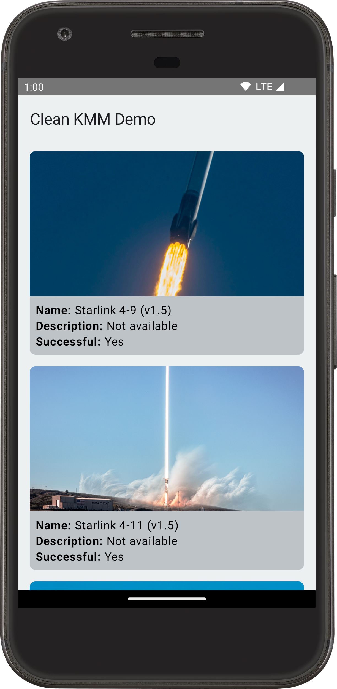
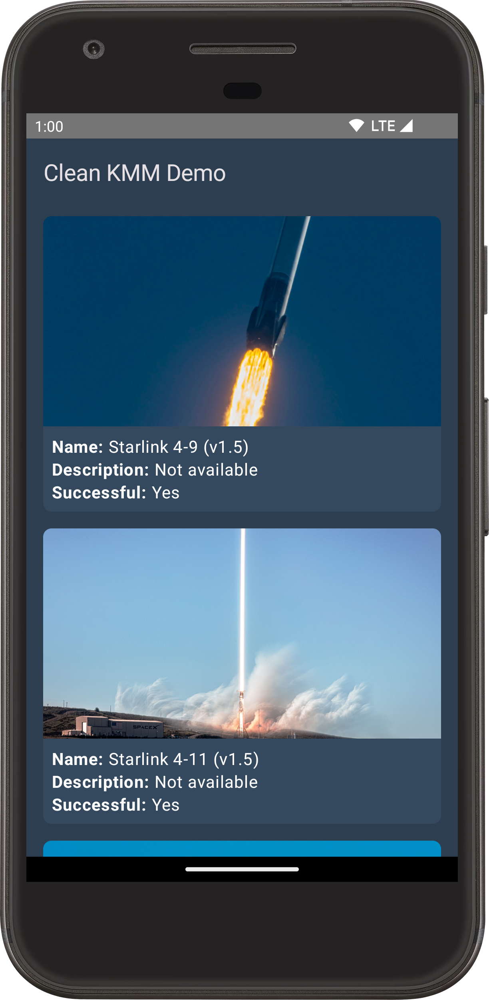
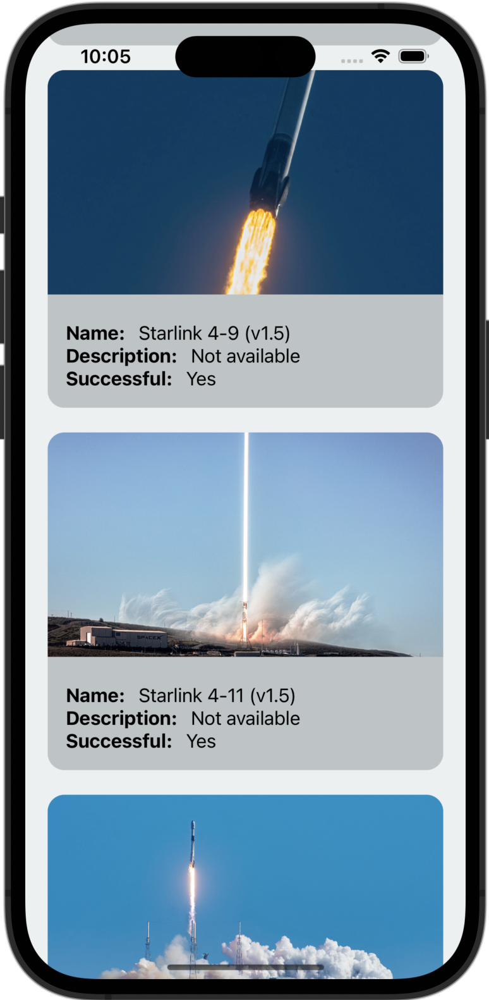
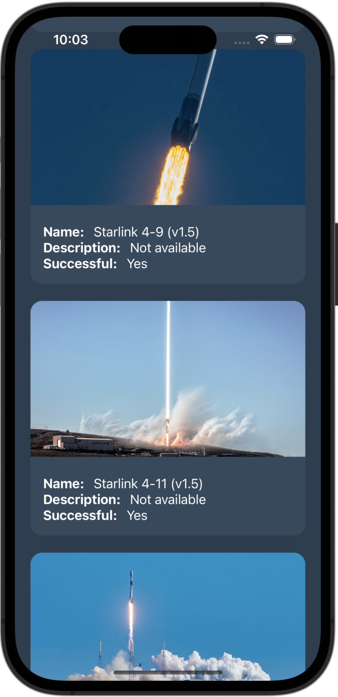

This is a basic [KMM](https://kotlinlang.org/lp/mobile/) demo app. It displays the list of SpaceX rocket launches.

## Functionality

The app is quite basic in terms of functionality. It has a single page that displays the list of SpaceX
rocket launches. It reads the data from a REST API if Internet is connected, otherwise it loads the data from the database.

## Goals

The most important goal for me was to get more familiar with KMM by building a KMM app from scratch.

The second goal was to have a kind of blueprint for a typical KMM app that is implemented in a clean and scalable
way using the latest technologies and best practices.

## Components/Modules

* `androidApp`: an Android application module containing the UI part of the Android app.
* `iosApp`: an iOS application that contains the UI part of the iOS app.
* `shared`: a KMM module that contains the shared code between the Android and iOS apps.

Everything except the UI implementation is shared between the Android and iOS apps.

## Tools and Technologies

* [Kotlin](https://kotlinlang.org/)
* [Swift](https://developer.apple.com/swift/)
* [Jetpack Compose](https://developer.android.com/jetpack/compose)
* [SwiftUI](https://developer.apple.com/xcode/swiftui/)
* [Coroutines + Flows](https://github.com/Kotlin/kotlinx.coroutines)
* [Ktor Client](https://github.com/ktorio/ktor)
* [SqlDelight](https://github.com/cashapp/sqldelight)
* [Koin](https://github.com/InsertKoinIO/koin)
* [Coil](https://github.com/coil-kt/coil)
* [Kermit](https://github.com/touchlab/Kermit)
* [KMM ViewModel](https://github.com/rickclephas/KMM-ViewModel)

## Architecture

The overall architecture of the app is Clean architecture and MVVM is used for the presentation layer.

## Screenshots

### Android

  
  

### iOS

  
  

